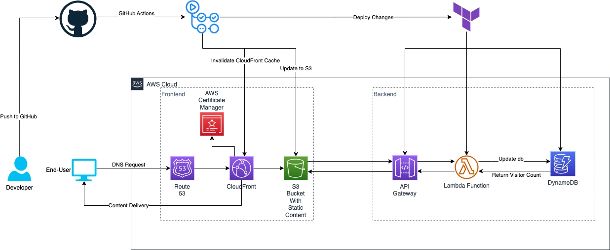

# Esteban Moreno — DevOps Portfolio

[](https://estebanmoreno.link)
[](https://www.linkedin.com/in/estebanmorenoramirez/)
[](https://blog.estebanmoreno.link)
[](LICENSE)

Personal portfolio and Cloud Resume Challenge implementation — a fully serverless AWS application with automated CI/CD.

[View Live Site](https://estebanmoreno.link) · [Read the Blog Series](https://blog.estebanmoreno.link/series/cloud-resume-challenge) · [Report Bug](https://github.com/estebanmorenoit/estebanmoreno-portfolio/issues)

---

## About

This project is my take on the [Cloud Resume Challenge](https://cloudresumechallenge.dev/) — a hands-on project that proves real-world AWS skills by building and deploying a production-grade personal portfolio entirely on AWS.

The site is fully serverless: static assets served from S3 via CloudFront, a live visitor counter backed by API Gateway → Lambda → DynamoDB, infrastructure managed with Terraform, and deployments automated end-to-end with GitHub Actions.

[](https://estebanmoreno.link)

---

## Architecture

```text
Browser
  └── CloudFront (CDN + HTTPS)
        ├── S3 (static site — HTML, CSS, JS)
        └── API Gateway
              └── Lambda
                    └── DynamoDB (visitor counter)
```

Every page load triggers a real API call through this stack, incrementing and returning the visitor count — demonstrating end-to-end serverless integration.

---

## Built With

[](https://developer.mozilla.org/en-US/docs/Web/HTML)
[](https://developer.mozilla.org/en-US/docs/Web/CSS)
[](https://developer.mozilla.org/en-US/docs/Web/JavaScript)
[](https://aws.amazon.com)
[](https://www.terraform.io/)
[](https://github.com/features/actions)

---

## Features

- **Static site** — HTML/CSS/JS hosted on S3, distributed globally via CloudFront
- **HTTPS** — SSL certificate managed by AWS Certificate Manager
- **Custom domain** — Route 53 DNS configuration
- **Live visitor counter** — serverless API built with API Gateway, Lambda, and DynamoDB
- **Infrastructure as Code** — all AWS resources provisioned and managed with Terraform
- **CI/CD pipeline** — GitHub Actions deploys frontend and backend automatically on push to `main`
- **Responsive design** — fluid layout with hamburger nav, works across all device sizes
- **Dark / light mode** — theme preference persisted in `localStorage`

---

## Project Structure

```text
estebanmoreno-portfolio/
├── assets/
│   ├── css/          # Stylesheet (portfolio-v2.css)
│   └── js/           # Visitor counter, contact form, scroll-to-top
├── images/           # Project images and resume PDF
├── infra/            # Terraform — S3, CloudFront, Lambda, DynamoDB, API Gateway
├── resume/           # Resume source files and generation script
├── archive/          # v1 design preserved for reference
└── index.html        # Main portfolio page
```

---

## Getting Started

The site is plain HTML/CSS/JS — no build step required.

```bash
git clone https://github.com/estebanmorenoit/estebanmoreno-portfolio.git
cd estebanmoreno-portfolio
# Open index.html in a browser, or use a local server:
npx serve .
```

To deploy the infrastructure:

```bash
cd infra
terraform init
terraform apply
```

---

## Roadmap

- [x] Static site hosted on S3 + CloudFront
- [x] Custom domain with Route 53 and ACM
- [x] Serverless visitor counter (API Gateway + Lambda + DynamoDB)
- [x] Infrastructure as Code with Terraform
- [x] CI/CD pipeline with GitHub Actions
- [x] Responsive design with dark/light mode
- [x] Contact form via Formspree
- [x] Automated dependency updates with Renovate

---

## License

Distributed under the MIT License. See [`LICENSE`](LICENSE) for more information.

---

## Contact

Esteban Moreno — [morenoramirezesteban@gmail.com](mailto:morenoramirezesteban@gmail.com)

Portfolio: [estebanmoreno.link](https://estebanmoreno.link) · Blog: [blog.estebanmoreno.link](https://blog.estebanmoreno.link)

---

## Acknowledgements

- [Cloud Resume Challenge](https://cloudresumechallenge.dev/) by Forrest Brazeal
- [Hashnode](https://hashnode.com/) for blog hosting and GraphQL API
- [Formspree](https://formspree.io/) for contact form handling
